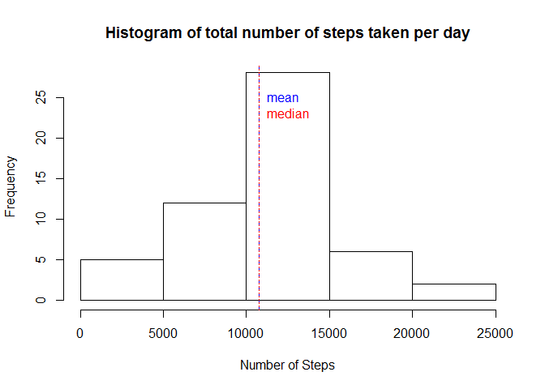
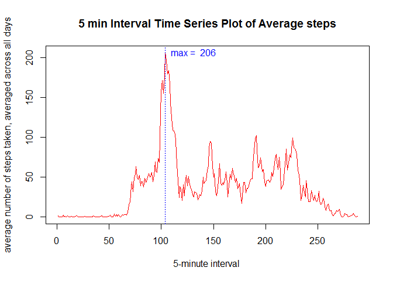
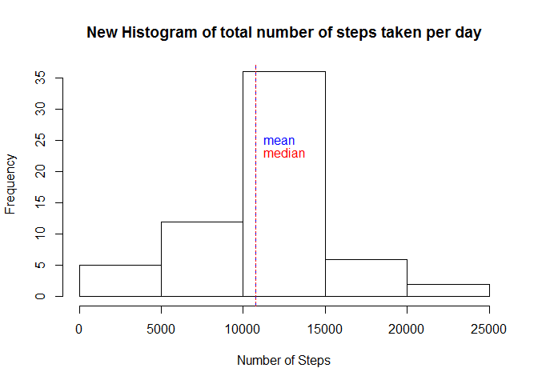
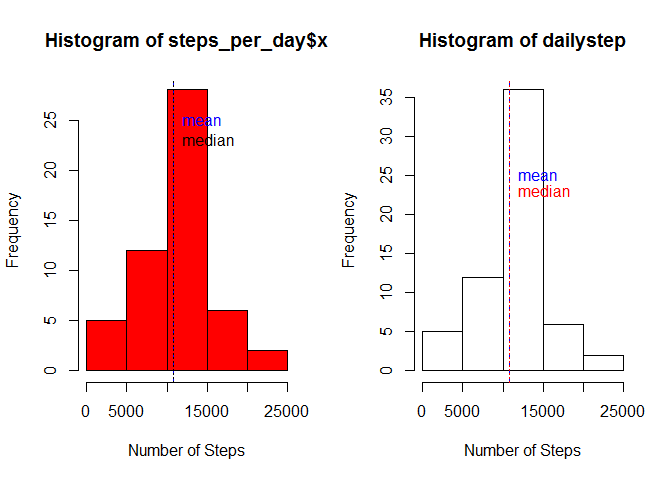
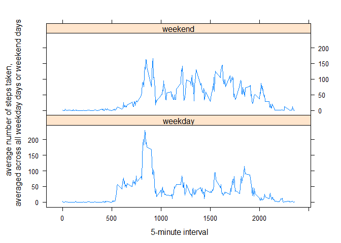

# Reproducible Research: Peer Assessment 1

#Peer Assessment 1 for Reproducible Research
===================================================


###Introduction
---------------------

This assignment makes use of data from a personal activity monitoring device. This device collects data at 5 minute intervals through out the day. The data consists of two months of data from an anonymous individual collected during the months of October and November, 2012 and include the number of steps taken in 5 minute intervals each day.

### Data
-------------------------


The data for this assignment can be downloaded from the course web site:

Dataset: Activity monitoring data [52K]
The variables included in this dataset are:

. **steps**: Number of steps taking in a 5-minute interval (missing values are coded as NA)

. **date**: The date on which the measurement was taken in YYYY-MM-DD format

. **interval**: Identifier for the 5-minute interval in which measurement was taken

The dataset is stored in a comma-separated-value (CSV) file and there are a total of 17,568 observations in this dataset.

### Loading and preprocessing the data

Here we download the data. 

Code for downloading the data:


```r
getwd()
```

```
## [1] "C:/Dataset/RepData_PeerAssessment1"
```

```r
setwd("C:/Dataset")
fileurl<-"http://d396qusza40orc.cloudfront.net/repdata%2Fdata%2Factivity.zip"
download.file(fileurl, destfile ="C:/Dataset/Activity_monitoring_data.zip")
unzip ("Activity_monitoring_data.zip", exdir="Activity_monitoring_data")

Activity<-read.csv ("C:/Dataset/Activity_monitoring_data/activity.csv")
head(Activity)
```

```
##   steps       date interval
## 1    NA 2012-10-01        0
## 2    NA 2012-10-01        5
## 3    NA 2012-10-01       10
## 4    NA 2012-10-01       15
## 5    NA 2012-10-01       20
## 6    NA 2012-10-01       25
```
Removing the missing values:

```r
Activity_sub<- Activity[!is.na(Activity$steps),]
```


### What is mean total number of steps taken per day?


1.**Total number of steps per day:**


```r
steps_per_day<-aggregate(Activity_sub$steps, by =list(date=Activity_sub$date) , FUN=sum)# Number of steps per day.
```


2.**Histogram of the total number of steps taken each day:**


```r
  hist(steps_per_day$x,col="white",main= "Histogram of total number of steps taken per day",xlab="Number of Steps")
  
abline(v=mean(steps_per_day$x), lty=20, col="blue")                   # draw a blue line thru the mean 

abline(v=median(steps_per_day$x), lty=3, col="red")                  # draw a red line thru the median  

text(mean(steps_per_day$x),25,labels="mean", pos=4, col="blue")      # label the mean  
text(median(steps_per_day$x),23,labels="median", pos=4, col="red")
```

 


3. **calculate the mean and median(i.e-summary staistics):**


```r
        summary(steps_per_day$x)
```

```
##    Min. 1st Qu.  Median    Mean 3rd Qu.    Max. 
##      41    8841   10760   10770   13290   21190
```

The mean total number of steps taken per day is 1.0766189\times 10^{4}.

The median total number of steps taken per day is 10765.


## What is the average daily activity pattern?

Calculate  the  average number of steps taken, averaged across all days:


```r
steps_interval<-aggregate(Activity_sub$steps, by =list(interval=Activity_sub$interval) , FUN=mean)
```
 
1. ** Make a time series plot (i.e. type = "l") of the 5-minute interval (x-axis) and   the average number of steps taken, averaged across all days (y-axis)**


```r
plot(steps_interval$x, type="l",  
     main="5 min Interval Time Series Plot of Average steps", 
     ylab="average number of steps taken, averaged across all days", 
     xlab="5-minute interval ", col="red")                          # plot the 5' time series
abline(v=which.max(steps_interval$x), lty=3, col="blue")                   # draw a red line thru the median  
text(which.max(steps_interval$x),max(steps_interval$x),  
     labels=paste("max = ",as.character(round (max(steps_interval$x)))), 
    pos=4 , col="blue") 
```

 

    
2.**Which 5-minute interval, on average across all the days in the dataset, contains the maximum number of steps?**


```r
b<-which.max(steps_interval$x)
a<-round(max(steps_interval$x))
```
**The 5-minute interval, on average across all the days in the dataset, contains the maximum number of steps is 104 with a maximum number of steps of 206.**


## Imputing missing values


Note that there are a number of days/intervals where there are missing values (coded as NA). The presence of missing days may introduce bias into some calculations or summaries of the data.

1.**Calculate and report the total number of missing values in the dataset (i.e. the total number of rows with NAs)**


```r
Activity_missing<- Activity[is.na(Activity$steps),]
c<-length (Activity_sub$steps)
```

Total number of missing values in the dataset is 15264.

2. **Devise a strategy for filling in all of the missing values in the dataset. The strategy does not need to be sophisticated. For example, you could use the mean/median for that day, or the mean for that 5-minute interval, etc.**

My strategy for filling in all the missing values in the data set is to use  mean across all days for the 5-minute interval in places where NA occurs.

3.**Create a new dataset that is equal to the original dataset but with the missing data filled in.**


```r
subactivity<-subset(Activity,complete.cases(Activity)==TRUE)

split_Interval <- split(subactivity,subactivity$interval, drop=TRUE)     # split the complete cases by date  

Avg <- sapply(split_Interval, function(x) mean(x$steps))

originalValue<- complete.cases(Activity)

newactivity <- cbind(Activity,originalValue)# newactivity with 'originalValue' column  

split_new<-split(newactivity,newactivity$originalValue, drop=TRUE)


for (row in 1:nrow(split_new[["FALSE"]])){  
    split_new[["FALSE"]][row,1] <- round(subset(Avg,names(Avg) ==
                                     as.character(split_new[["FALSE"]][row,3])))
}# replacing the the NA by values 
```

Now that we are done with the imputation, we need to join the dataset by using rbind and form a new data set.

```r
newdataset <- rbind(split_new[["FALSE"]],split_new[["TRUE"]])           # combine the TRUE & FALSE data frames  
newdataset <- newdataset[with(newdataset, order(date, interval)), ] 
```

**Total number of steps per day from new data set:**


```r
splitNewdata <- split(newdataset,newdataset$date, drop=TRUE)              

dailystep <- sapply(splitNewdata, function(x) sum(x$steps))
```


3.**Make a histogram of the total number of steps taken each day and Calculate and report the mean and median total number of steps taken per day.**


```r
  hist(dailystep,col="white",main= "New Histogram of total number of steps taken per day",xlab="Number of Steps")
  
abline(v=mean(dailystep), lty=20, col="blue")                   # draw a blue line thru the mean 

abline(v=median(dailystep), lty=3, col="red")                  # draw a red line thru the median  

text(mean(dailystep),25,labels="mean", pos=4, col="blue")      # label the mean  
text(median(dailystep),23,labels="median", pos=4, col="red")
```

 


**calculate the mean and median(i.e-summary staistics):**


```r
        summary(dailystep)
```

```
##    Min. 1st Qu.  Median    Mean 3rd Qu.    Max. 
##      41    9819   10760   10770   12810   21190
```

```r
mean_step1<-mean(dailystep)
median_step1<-median(dailystep)
```
The mean total number of steps taken per day is 1.0765639\times 10^{4}.

The median total number of steps taken per day is 1.0762\times 10^{4}.


4.**Do these values differ from the estimates from the first part of the assignment? What is the impact of imputing missing data on the estimates of the total daily number of steps?**


```r
summary(dailystep)# for imputed data set
```

```
##    Min. 1st Qu.  Median    Mean 3rd Qu.    Max. 
##      41    9819   10760   10770   12810   21190
```

```r
 summary(steps_per_day$x) # for original dataset
```

```
##    Min. 1st Qu.  Median    Mean 3rd Qu.    Max. 
##      41    8841   10760   10770   13290   21190
```
 
 The mean and median from the two data set does not vary but there is a difference between the quartiles.

"Comparison between the Histogram of total number of steps taken per day from new and old dataset"


```r
par(mfrow=c(1,2))

# Plot for original dataset

 hist(steps_per_day$x,col="red",xlab="Number of Steps")
  
abline(v=mean(steps_per_day$x), lty=20, col="blue")                   # draw a blue line thru the mean 

abline(v=median(steps_per_day$x), lty=3, col="black")                  # draw a red line thru the median  

text(mean(steps_per_day$x),25,labels="mean", pos=4, col="blue")      # label the mean  
text(median(steps_per_day$x),23,labels="median", pos=4, col="black")

##############################
# Plot for new dataset
hist(dailystep,col="white",xlab="Number of Steps")
  
abline(v=mean(dailystep), lty=20, col="blue")                   # draw a blue line thru the mean 

abline(v=median(dailystep), lty=3, col="red")                  # draw a red line thru the median  

text(mean(dailystep),25,labels="mean", pos=4, col="blue")      # label the mean  
text(median(dailystep),23,labels="median", pos=4, col="red")
```

 

The impact of imputing missing data on the estimates of the total daily number of steps is that there is just a difference in the frequency for the center bar of new histogram (as shown in comparison graph)


## Are there differences in activity patterns between weekdays and weekends?

1.**Create a new factor variable in the dataset with two levels - "weekday" and "weekend" indicating whether a given date is a weekday or weekend day.**


```r
newdataset$date <- as.Date(strptime(newdataset$date, format="%Y-%m-%d")) 
newdataset$day <- weekdays(newdataset$date)     

for (i in 1:nrow(newdataset)) {                                       
    if (newdataset[i,]$day %in% c("Saturday","Sunday")) {             
        newdataset[i,]$day<-"weekend"                                 
    }
    else{
        newdataset[i,]$day<-"weekday"                                
    }
}

stepsperday <- aggregate(newdataset$steps ~ newdataset$interval + newdataset$day, newdataset, mean)
```

2.**Make a panel plot containing a time series plot (i.e. type = "l") of the 5-minute interval (x-axis) and the average number of steps taken, averaged across all weekday days or weekend days (y-axis). See the README file in the GitHub repository to see an example of what this plot should look like using simulated data.**


Lets plot the steps per day for weekdays and weekends and see if there is any difference between the walking pattern of that individual.


```r
names(stepsperday) <- c("interval", "day", "steps")
library(lattice)
xyplot(stepsperday$steps ~ stepsperday$interval | stepsperday$day, 
       layout = c(1, 2), type = "l", 
       xlab = " 5-minute interval", ylab = "average number of steps taken,
       averaged across all weekday days or weekend days")
```

 

It looks like this person does his workwout more on weekends than on weekday. He walks more on weekends than on weekdays.
